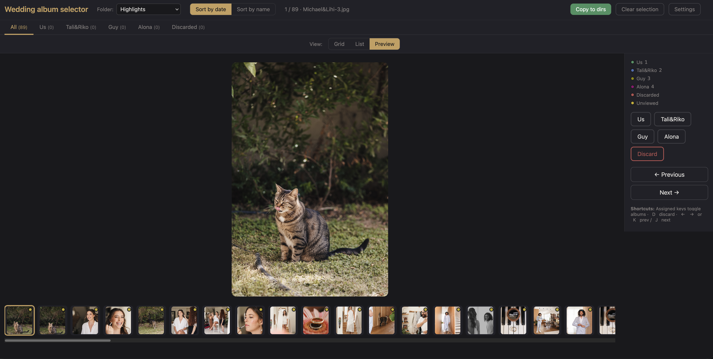

# Wedding photo album selector

A local web tool to triage photos into custom albums, preview quickly, and export selected files.

## Preview



## Features

- Multiple source folders (root + subfolders under `photos/`)
- Per-source selections saved as JSON
- Album assignment + discard, with keyboard shortcuts
- Configurable albums (name, color, key) from **Settings**
- Status dots in slider/grid/list (can show multiple albums)
- View modes per tab: **Preview**, **Grid**, **List**
- Global toggle: **Assigned from all folders** (cross-source view)
- Copy selected photos into output directories

## Setup

```bash
python -m venv .venv
source .venv/bin/activate   # or .venv\Scripts\activate on Windows
pip install -r requirements.txt
```

## Run

Default (uses local `photos/`):

```bash
python app.py
```

Custom photos path:

```bash
python app.py /path/to/your/wedding/photos
```

Open [http://127.0.0.1:8000](http://127.0.0.1:8000).

## Folder structure

The app works with photos in root and/or subfolders:

```text
photos/
  IMG_0001.jpg
  Highlights/
    IMG_1001.jpg
  Family/
    IMG_2001.jpg
```

Use the **Folder** dropdown to switch source.

## Usage

- **Sort**: Date (EXIF fallback mtime) or Name (natural sort)
- **Assign**: Click album button or use configured key
- **Discard**: `D` / `Delete`
- **Navigate**: `←` / `→` or `K` / `J`
- **Tabs**: `All`, album tabs, `Discarded`
- **View**: `Preview`, `Grid`, `List` (remembered per tab)
- **Assigned from all folders** toggle:
  - Shows assigned/discarded photos across all source folders
  - Tabs become cross-source views
  - Source selector and editing actions are disabled (view-only)

## Album settings

Open **Settings** (top-right) to customize albums:

- Label (display name)
- Color (used in buttons/legend/status dots)
- Key (shortcut)
- Add/remove albums

Config is stored in:

- `config/albums.json`

## Selection files

Selections are saved per source folder:

- Root source: `selections/_root/`
- Subfolder source (example `Highlights`): `selections/Highlights/`

Each source contains:

- `album_<album_id>.json` for each album
- `discarded.json`

Each JSON file is an array of filenames.

## Export selected photos

Click **Copy to dirs** to export selections.

Output is grouped by source and album, e.g.:

```text
output/
  _root/
    album_us/
  Highlights/
    album_my_parents/
```

## Notes

- Supported formats: `.jpg`, `.jpeg`, `.png`, `.gif`, `.webp`, `.heic`
- This is a local Flask app intended for personal workflows
